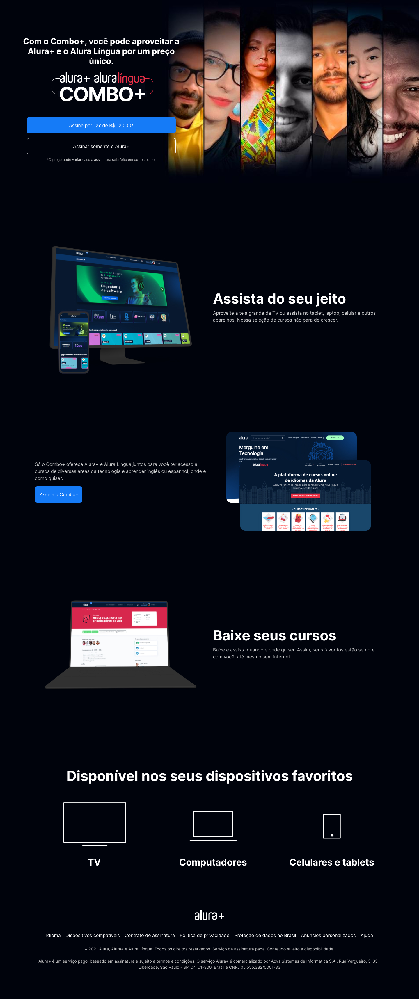

<h1 align="center"> Alura Plus </h1>

  <a href="#-tecnologias">Tecnologias</a>&nbsp;&nbsp;&nbsp;|&nbsp;&nbsp;&nbsp;
  <a href="#-projeto">Projeto</a>&nbsp;&nbsp;&nbsp;|&nbsp;&nbsp;&nbsp;
  <a href="#-layout">Layout</a>&nbsp;&nbsp;&nbsp;|&nbsp;&nbsp;&nbsp;

 

  

## 🚀 Tecnologias

Esse projeto foi desenvolvido com as seguintes tecnologias:

- HTML e CSS
- Git e Github
- Figma

## 💻 Projeto

O Alura Plus é um serviço de streaming estatico formado pela Alura+ e o Alura Língua

- [Acesse o projeto finalizado, online](https://liceb.github.io/AluraPlus/)

- [Assistir aulas](https://cursos.alura.com.br/course/html-css-praticando-html-css)

## 🔖 Layout

Você pode visualizar o layout do projeto através [DESSE LINK](https://www.figma.com/file/tFDVyNuKhrT2G03k2dCstW/Alura-Plus---Layout?node-id=1-77&t=PW9tv1onnKFyyLUK-0). É necessário ter conta no [Figma](https://figma.com) para acessá-lo.
